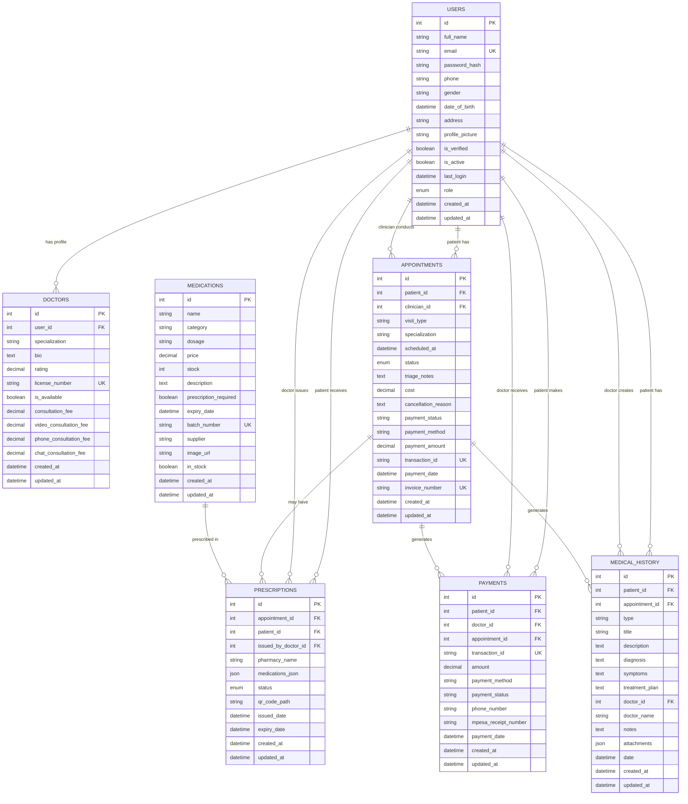
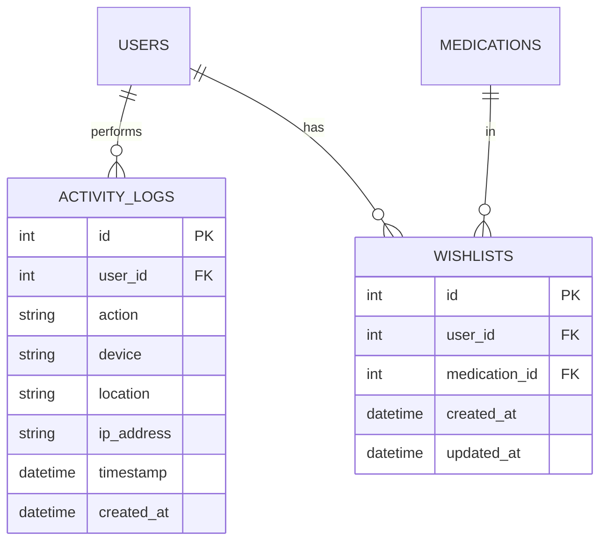

# Kiangombe Health Center - Entity Relationship Diagram

## Database Overview
This ERD represents a comprehensive health center management system with the following main entities:
- User Management (Patients, Doctors, Staff)
- Appointments & Scheduling
- Medical Records & History
- Prescriptions & Medications
- Payments & Billing
- Pharmacy Inventory

---

## Core Entity Relationships



---

## Patient Profile Support Tables

```mermaid
erDiagram
    MEDICAL_INFO {
        int id PK
        int patient_id FK UK
        string blood_type
        string height
        string weight
        json allergies
        json conditions
        json medications
        datetime created_at
        datetime updated_at
    }
    
    EMERGENCY_CONTACTS {
        int id PK
        int patient_id FK UK
        string name
        string phone
        string relation
        datetime created_at
        datetime updated_at
    }
    
    INSURANCE {
        int id PK
        int patient_id FK UK
        string provider
        string policy_number
        string group_number
        string holder_name
        string insurance_type
        decimal quarterly_limit
        decimal quarterly_used
        datetime coverage_start_date
        datetime coverage_end_date
        datetime created_at
        datetime updated_at
    }
    
    NOTIFICATION_SETTINGS {
        int id PK
        int patient_id FK UK
        boolean email_notifications
        boolean sms_notifications
        boolean appointment_reminders
        boolean lab_results_notifications
        datetime created_at
        datetime updated_at
    }
    
    SECURITY_SETTINGS {
        int id PK
        int patient_id FK UK
        boolean two_factor_enabled
        boolean login_alerts
        datetime created_at
        datetime updated_at
    }

    USERS ||--|| MEDICAL_INFO : "has"
    USERS ||--|| EMERGENCY_CONTACTS : "has"
    USERS ||--|| INSURANCE : "has"
    USERS ||--|| NOTIFICATION_SETTINGS : "has"
    USERS ||--|| SECURITY_SETTINGS : "has"
```

---

## Staff Management Tables

```mermaid
erDiagram
    NURSES {
        int id PK
        int user_id FK UK
        string specialization
        text bio
        string license_number UK
        boolean is_available
        datetime created_at
        datetime updated_at
    }
    
    RECEPTIONISTS {
        int id PK
        int user_id FK UK
        text bio
        boolean is_available
        datetime created_at
        datetime updated_at
    }
    
    LAB_TECHNICIANS {
        int id PK
        int user_id FK UK
        string specialization
        text bio
        string license_number UK
        boolean is_available
        datetime created_at
        datetime updated_at
    }
    
    PHARMACISTS {
        int id PK
        int user_id FK UK
        string specialization
        text bio
        string license_number UK
        boolean is_available
        datetime created_at
        datetime updated_at
    }
    
    DOCTOR_AVAILABILITY {
        int id PK
        int doctor_id FK
        enum day
        boolean is_open
        string start_time
        string end_time
        string break_start
        string break_end
        int appointment_duration
        int buffer_time
        int max_appointments_per_day
        datetime created_at
        datetime updated_at
    }
    
    DOCTOR_SETTINGS {
        int id PK
        int doctor_id FK UK
        boolean show_profile_to_patients
        boolean show_rating_reviews
        boolean allow_online_booking
        boolean show_availability
        boolean email_notifications
        boolean sms_notifications
        boolean appointment_reminders
        boolean new_appointment_requests
        boolean cancellation_alerts
        boolean weekly_summary
        datetime created_at
        datetime updated_at
    }

    USERS ||--|| NURSES : "has profile"
    USERS ||--|| RECEPTIONISTS : "has profile"
    USERS ||--|| LAB_TECHNICIANS : "has profile"
    USERS ||--|| PHARMACISTS : "has profile"
    DOCTORS ||--o{ DOCTOR_AVAILABILITY : "has schedule"
    DOCTORS ||--|| DOCTOR_SETTINGS : "has settings"
```

---

## Additional Support Tables



---

## Key Relationships Summary

### Primary Relationships:
1. **Users** is the central table with one-to-one relationships to profile tables
2. **Appointments** link patients to clinicians and generate payments/medical records
3. **Prescriptions** are created from appointments and contain medication details
4. **Payments** are tied to appointments and link patients to doctors
5. **Medical History** tracks all patient interactions through appointments

### Cardinality Patterns:
- **One-to-One**: User ↔ Profile tables (Medical Info, Emergency Contact, etc.)
- **One-to-Many**: User ↔ Appointments, User ↔ Medical History, Doctor ↔ Availability
- **Many-to-Many**: User ↔ Medication (through Wishlist)

### Foreign Key References:
- All profile tables reference `users.id`
- Appointment tables reference `users.id` for both patient and clinician
- Medical records reference both patient and doctor through `users.id`

---

## Data Types & Constraints

### Common Patterns:
- **Primary Keys**: Integer, auto-increment
- **Foreign Keys**: Integer, indexed
- **Timestamps**: DateTime with `func.now()` defaults
- **Enums**: For status fields (appointment_status, prescription_status, user_role)
- **JSON**: For complex data (allergies, conditions, medications, attachments)
- **Decimal**: For financial values (precision=10, scale=2)
- **Boolean**: For flags and settings
- **String**: Various lengths based on content

### Constraints:
- **Unique**: Email addresses, license numbers, transaction IDs, invoice numbers
- **Indexed**: Foreign keys, frequently queried fields
- **Nullable**: Optional fields marked as nullable
- **Defaults**: Sensible defaults for boolean flags and timestamps

---

## Import Notes for Microsoft Access

1. **Create tables in order**: Start with USERS, then dependent tables
2. **Handle Enums**: Convert to Text fields with validation rules
3. **JSON Fields**: Convert to Memo fields or separate related tables
4. **Relationships**: Set up referential integrity after all tables exist
5. **Indexes**: Create on foreign keys and frequently searched fields
6. **Data Types**: Map SQLAlchemy types to Access equivalents:
   - Integer → Number (Long Integer)
   - String → Text
   - Text → Memo
   - DateTime → Date/Time
   - Decimal → Number (Double)
   - Boolean → Yes/No
   - JSON → Memo (or parse into related tables)
